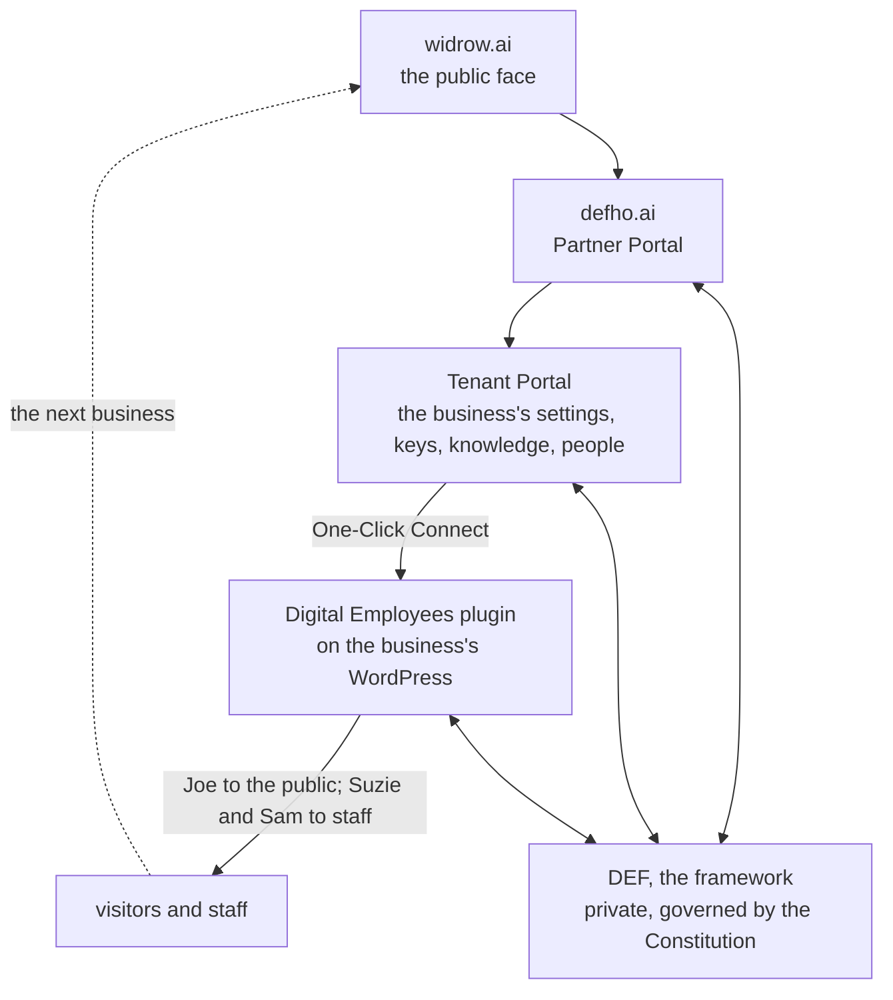

# Digital Employees

AI-powered Digital Employees for your WordPress site. Customer-facing chat, internal staff assistant, and intelligent setup — all connected to the [Digital Employee Framework](https://defho.ai/).

  

## Where this plugin sits

def-core is the open-source WordPress bridge for the Digital Employee Framework (DEF), built and operated by A3REV Software (ABN 32 556 307 251, Golden Beach, Queensland, Australia). The framework itself is private; this plugin is the part that runs on your own server, so you can read exactly what it does.

The framework is governed by a published constitution and reaches businesses through partners. A3REV's own product on it is Widrow, and that is where the framework's public documents live:

- [The DEF Constitution, version 1.0](https://widrow.ai/the-def-constitution-version-1-0/)
- [Privacy Statement](https://widrow.ai/privacy-statement/)
- [Security and continuity](https://widrow.ai/security/) — where data runs, what is held, and what happens when you leave
- The three Digital Employees this plugin delivers: [Joe](https://widrow.ai/digital-employees/joe/) (Customer Chat), [Suzie](https://widrow.ai/digital-employees/suzie/) (Staff AI) and [Sam](https://widrow.ai/digital-employees/sam/) (Setup Assistant)

## What Are Digital Employees?

Digital Employees are AI agents that work alongside your team. They understand your business context, follow governance rules, and operate across multiple channels:

### Customer Chat (Joe)
A chat widget for your site visitors. Floating button or embedded via shortcode. Answers questions using your site's content, products, and knowledge base. Streams responses in real-time with word-by-word rendering.

**Digital Sales Assistant**
- Product inquiries, pricing, features, and comparisons
- Personalised product recommendations
- Add-to-cart and checkout assistance
- Knowledge base search across your site content
- File upload and image understanding
- Escalation to human support

**Digital Support Assistant**
- Order lookup and status tracking
- Subscription and license management
- Support ticket retrieval
- Refund and cancellation assistance
- Account and billing inquiries
- File upload for troubleshooting (screenshots, error logs, documents)
- Document extraction (PDF, DOCX, XLSX, CSV)
- Escalation to human support

### Staff AI (Suzie)
An internal AI assistant in wp-admin for your team. Available to users with the appropriate role.

**Digital Staff Assistant**
- Document creation (DOCX, PDF, Markdown)
- Spreadsheet and data file creation (XLSX, CSV)
- Image generation from text descriptions
- General writing, ideation, and research assistance
- Staff-level knowledge base retrieval
- File upload and content extraction
- Cross-chat user memory (remembers context across conversations)
- Escalation to human support
- Sub-agent delegation (analyst, researcher, writer)

**Digital Management Assistant**
- All Staff Assistant capabilities
- Management-level knowledge base access
- Access to confidential and management documents

### Setup Assistant (Sam)
An intelligent configuration agent that lives in your wp-admin settings. Guides you through plugin setup conversationally — configures branding, chat settings, user roles, and connection status. Knows the current state of every setting.

- Full setup status overview
- Read and update any plugin setting
- Connection testing and troubleshooting
- User role and capability management (search, assign, remove)
- Theme color detection for chat button styling
- Guided setup flow (connection, branding, escalation, user roles, chat settings)
- File upload and content extraction
- Escalation to your DEF Partner for hands-on help

## Requirements

- WordPress 6.2+
- PHP 8.0+
- A tenancy on the Digital Employee Framework, set up for you by a Widrow partner (A3REV Software or another partner) in the Partner Portal at [defho.ai](https://defho.ai/)

## Installation

### From GitHub Releases

1. Download [digital-employees.zip](https://github.com/a3rev-ai/def-core/releases/latest/download/digital-employees.zip) from the latest release
2. In WordPress, go to **Plugins > Add New > Upload Plugin**
3. Upload the .zip and click **Install Now**
4. Activate the plugin

The plugin checks GitHub for updates automatically — you'll see standard WordPress update notifications when a new version is available.

### Manual

1. Clone or download this repository
2. Upload the `def-core` folder to `/wp-content/plugins/`
3. Activate via **Plugins > Installed Plugins**

## What changed, and when

Every release carries a dated entry in plain words in [changelog.txt](changelog.txt), and the same entries appear on the [Releases page](https://github.com/a3rev-ai/def-core/releases) beside the plugin zip. The engineering rules the plugin is built to are in [docs/](docs/), dated when adopted.

## Getting Started

1. **Your partner sets up your tenancy** — a Widrow partner (A3REV Software or another) creates it in the Partner Portal at [defho.ai](https://defho.ai/) and invites you to your Tenant Portal. There is no self-serve sign-up.
2. **Install** the plugin on your WordPress site
3. **Connect** — One-Click Connect from your Tenant Portal (or enter credentials manually on the Connection tab)
4. **Configure** — Sam, the Setup Assistant, guides you through branding, chat settings, and user roles

Once connected, Customer Chat is available on your frontend and Staff AI is available in wp-admin.

## How the four surfaces connect

1. **widrow.ai** is the public face of the framework: the site partners, A3REV Software among them, use to explain Digital Employees to a business.
2. **defho.ai** is the Partner Portal: a partner signs in, creates the tenant, and sets it up.
3. **The Tenant Portal**, hosted on defho.ai under the partner's subdomain, is where the business's own settings, keys, knowledge and people live.
4. **The Digital Employees plugin** (this repo) runs on the business's WordPress. One-Click Connect from the Tenant Portal links them. Joe serves the public; Suzie and Sam serve the business's own staff inside wp-admin.
5. Every surface talks to the **Digital Employee Framework**, which runs the employees and enforces the governance. It is private and governed by the published Constitution.

Joe talks to a business's visitors. Some of them run businesses. The next business meets Widrow, and the ring closes.

This plugin is the bridge. All AI logic, tool execution, employee orchestration and governance enforcement happen server-side in the framework. WordPress provides the user interface and the authentication context.

## Admin Settings

Five tabs under **Digital Employees** in wp-admin:

| Tab | What It Does |
|-----|-------------|
| **Branding** | Display name, logo, app icon |
| **Chat Settings** | Display mode, button position/color/icon/label, AI disclosure notice |
| **Escalation** | Email recipients for Customer Chat and Setup Assistant escalations |
| **User Roles** | Assign DEF capabilities (Staff AI access, Management access) per user |
| **Connection** | Connection status indicator (read-only when push-configured) |

## WooCommerce Integration

When WooCommerce is active, additional tools load automatically:

- Product search and browsing
- Cart synchronization
- Order lookup and status
- Knowledge export for product catalog indexing

## Shortcodes & Hooks

**Shortcode:**
- `[def_chat_button]` — Render the Customer Chat button at a specific location; `prompt="…"` makes it open the chat with that question asked and answered (any element with `data-def-chat-trigger` can carry `data-def-chat-prompt` the same way)
- `[def_changelog versions="12"]` — Render the plugin's own dated changelog, newest first

**Block:** the *Chat Button* block (8.7.0), under *Digital Employees* in the inserter, is the no-code form of the shortcode: a themed button with a Label and a Question to ask in its sidebar.

**Hooks:**
- `def_core_chat_button` — Action to render the chat button in theme templates
- `def_core_register_tools` — Register additional API tools
- `def_core_token_expiration` — Filter JWT token lifetime (default: 5 minutes)
- `def_core_chat_strings` — Filter Customer Chat UI strings for i18n

## REST API

| Endpoint | Method | Auth | Description |
|----------|--------|------|-------------|
| `/wp-json/a3-ai/v1/jwks` | GET | Public | JWKS public keys for JWT verification |
| `/wp-json/a3-ai/v1/context-token` | GET | WP Auth | Issue signed context token |
| `/wp-json/def-core/v1/content/export` | GET | API Key | Bulk content export for knowledge indexing |
| `/wp-json/def-core/v1/products/export` | GET | API Key | WooCommerce product export |
| `/wp-json/def-core/v1/connection-status` | GET | Public | Connection health check |

Tool endpoints (product search, cart operations, order lookup) are registered dynamically via the API registry.

## Security

- RSA-256 signed JWT tokens (5-minute expiry)
- All authority enforced server-side by the framework
- No secrets hard-coded — credentials stored in WordPress options
- Bearer token authentication for API endpoints
- Origin validation for cross-domain requests
- AI disclosure notice for visitor transparency
- WordPress nonce + cookie auth for admin endpoints

## External Services

This plugin connects to the Digital Employee Framework (DEF) API to power its AI features. Chat messages and user context are sent to the configured DEF server only when a user actively sends a message. No data is transmitted when chat features are not in use. See the [Widrow Privacy Statement](https://widrow.ai/privacy-statement/) for what is collected, where it is kept and for how long, and the [DEFHO Privacy Policy](https://defho.ai/privacy) and [Terms of Service](https://defho.ai/terms) for the platform's own terms.

## Contributing

Issues and pull requests welcome. See [CONTRIBUTING.md](CONTRIBUTING.md) for setup instructions, branch conventions, and PR requirements.

## License

GPLv2 or later. See [LICENSE](LICENSE) for full text.
